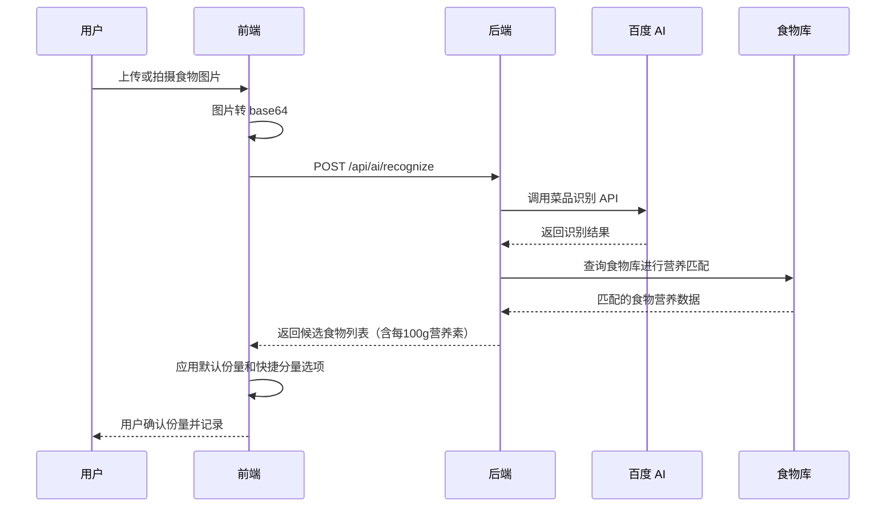

# AI 识别服务

轻卡记支持通过图片识别食物。AI 识别由后端统一调用百度 AI 菜品识别接口。

## 调用链路



## 前端入口

前端 AI 服务封装位于：

```txt
src/utils/aiService.ts
```

份量工具函数位于：

```txt
src/utils/servingSize.ts
```

页面入口：

```txt
src/views/AiPhoto.vue
```

前端负责：

- 获取图片
- 转换图片格式
- 调用后端识别接口
- 展示识别结果（含后端匹配的营养数据）
- 提供份量快捷调整（少量 / 标准 / 偏多 / 自定义克数）
- 让用户确认后添加餐食记录

## 后端服务

后端 AI 服务位于：

```txt
server/src/services/aiService.ts
```

营养匹配服务位于：

```txt
server/src/services/foodMatcher.ts
```

后端负责：

- 读取百度 AI 环境变量
- 获取百度 AI access token
- 调用菜品识别接口
- 将识别结果通过别名/模糊匹配关联到食物库
- 补齐每 100g 热量、蛋白质、脂肪、碳水
- 统一转换响应格式
- 隐藏第三方密钥

## 环境变量

后端需要配置：

```env
BAIDU_AI_API_KEY=your_baidu_api_key
BAIDU_AI_SECRET_KEY=your_baidu_secret_key
```

## 接口

```txt
POST /api/ai/recognize
```

该接口需要登录。

请求内容通常包含 base64 图片数据。

## 设计原则

- 第三方 AI 密钥只保存在服务端
- 前端不接触百度 AI 密钥
- 后端自动用食物库数据补齐营养素，前端优先使用服务端下发的营养值
- 前端根据食物类型提供合理的默认份量和快捷调整选项
- 用户确认后才写入餐食记录
- 识别失败时应给出中文错误提示

## 注意事项

AI 识别可能受到以下因素影响：

- 图片过暗
- 食物被遮挡
- 多种食物混在一起
- 拍摄角度不清晰
- 百度 AI 返回候选结果不准确

因此用户仍需要确认识别结果和食物份量。

