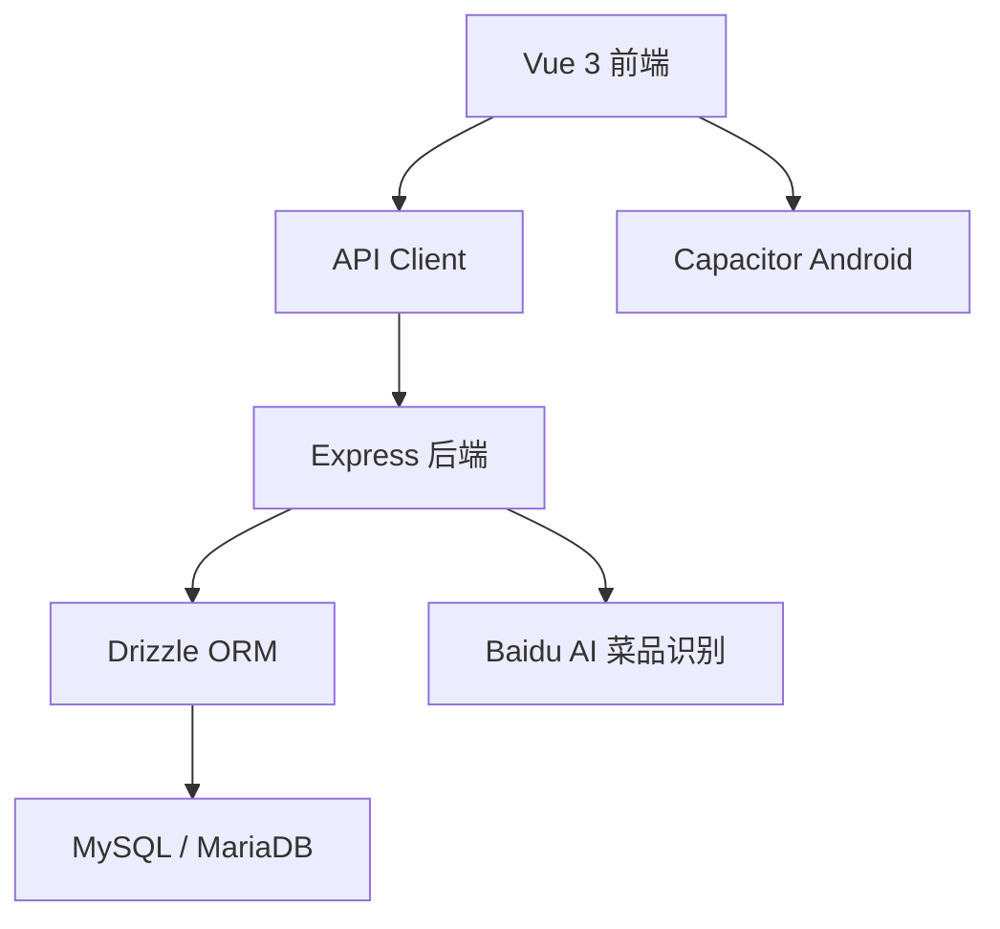

# 系统架构

轻卡记采用前后端分离架构。

前端使用 Vue 3 构建移动端界面，通过 Capacitor 打包为 Android 应用。后端使用 Express 提供 REST API，数据存储在 MySQL / MariaDB 中。

## 架构概览

## 前端职责

前端负责：

- 页面展示
- 用户交互
- 路由控制
- 状态管理
- Token 存储与刷新
- 调用后端 API
- 移动端适配
- Android 打包入口

## 后端职责

后端负责：

- 用户注册与登录
- JWT 鉴权
- 食物库管理
- 餐食记录管理
- 体重记录管理
- 用户设置管理
- 餐食模板管理
- AI 识别代理调用
- AI 识别结果营养匹配（foodMatcher）
- 数据库读写

## 认证流程

系统使用 access token 和 refresh token：

- access token 有效期 15 分钟
- refresh token 有效期 7 天
- 前端请求业务接口时携带 access token
- access token 过期后，前端自动调用刷新接口
- 刷新失败时退出登录并跳转到登录页

## 数据隔离

所有业务数据按 `user_id` 隔离。

内置食物的 `user_id` 为 `NULL`，所有用户可见。

自定义食物、餐食记录、体重记录、用户设置、餐食模板均与用户绑定。

